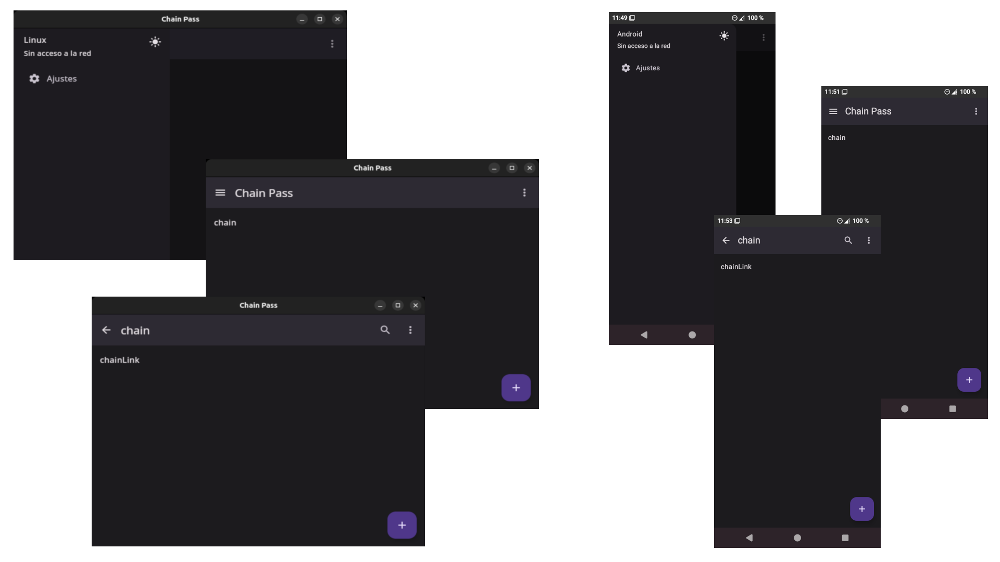

# Chain Pass

A project built with [JetBrains Compose Multiplatform](https://www.jetbrains.com/lp/compose-mpp/)
to save and manage passwords.

## Security

The cryptographic system consists of the `ChainKey(SecretKey)` with which the `ChainLink(Password)` are encrypted, and 
the authentication system that consists of the `ChainKey(PrivateKey)` validation.

The application asks the User to type the `Key` together with a randomly generated `Salt`, from which the`SecretKey` is 
derived, then the `Key` together with the `SecretKey` derives the `PrivateKey` that is saved to the Database.

`Chain(Key) -> Hash(Key,Salt)=SecretKey -> Hash(Key,SecretKey)=PrivateKey -> Chain(PrivateKey)`

The application asks the User to type the `Password` that is encrypted with the `SecretKey` together with a randomly 
generated `IV`, obtaining the`PrivatePassword` that is saved to the Database.

`ChainLink(Password) -> Encrypt(Password,(SecretKey,IV))=PrivatePassword -> ChainLink(PrivatePassword)`

### Known vulnerabilities

- Access to the User device allowing the attacker to steal or delete the Database.

**There is no way the attacker can decrypt `ChainLink(PrivatePassword)` because the `Chain(SecretKey)` is never leaked.**

## Distribution

To package applications run the following commands with Gradle:

- Create Desktop binaries with `gradlew desktop:packageDistributionForCurrentOS`
- Create Android APKs with `gradlew android:build`

**Packaging requires JDK 17 or later to be installed.**