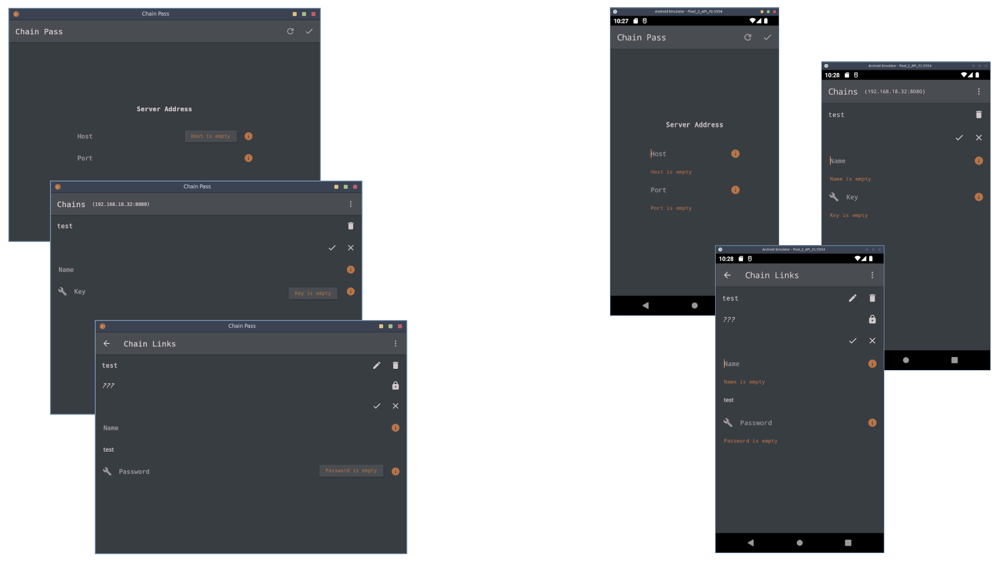

# Chain Pass

A project built with [JetBrains Compose Multiplatform](https://www.jetbrains.com/lp/compose-mpp/)
to save and manage passwords.

## Security

The cryptographic system consists of the `Chain(Key)` with which the `ChainLink(Password)` are encrypted, and the 
authentication system that consists of the `ChainKey(SaltKey)` validation.

The Client asks the User to type the `Key` from which it is derived the `SecretKey` with which the `Key` is encrypted, 
obtaining the `PrivateKey` that is sent to the Server saving it to the Database.

`Chain(Name,Key) -> Hash(Key,Name)=SecretKey -> Encrypt(Key,(SecretKey,Name))=PrivateKey -> Chain(Name,PrivateKey)`

The Client asks the User to type the `Password` that is encrypted with the `SecretKey` obtained before, obtaining 
the`PrivatePassword` that is sent to the Server saving it to the Database.

`ChainLink(Name,Password) -> Encrypt(Password,(SecretKey,Name))=PrivatePassword -> ChainLink(Name,PrivatePassword)`

The Client asks the Server to generate the random `Salt` used to derive the `SaltKey` from the `PrivateKey` obtained 
before, sending it to the Server to compare it with the `SaltKey` derived from the `PrivateKey` saved in the Database, 
using the last generated `Salt` awaiting in memory.

`Random()=Salt -> Hash(PrivateKey,Salt)=SaltKey -> ChainKey(SaltKey)`

### Known vulnerabilities

- Access to the User host network, allowing the attacker to intercept the `Chain(PrivateKey)` **the only time** it is 
sent to the Server, allowing the attacker to request the random `Salt` at any time, using them together to generate the 
`ChainKey(SaltKey)`, sending it to the Server and passing the validation, being able for the attacker to execute any 
Server operation, like deleting the `Chain(PrivateKey)` and related `ChainLink(PrivatePassword)`.
- Access to the Server host machine allowing the attacker to steal or delete the Database.

**There is no way the attacker can decrypt `ChainLink(PrivatePassword)` because the `Chain(SecretKey)` is never leaked.**

## Deployment

This project uses [Docker](https://www.docker.com/) for deployment.

To manage services run the following commands:

- Build and start services with `docker-compose -f ./docker-compose.yml up -d --build`
- Stop and terminate services with `docker-compose -f ./docker-compose.yml down`

## Distribution

To package applications run the following commands with Gradle:

- Create Desktop binaries with `desktop:package`
- Create Android APKs with `android:build`
- Create Server binaries with `server:package`

**Packaging requires JDK 17 to be installed.**
